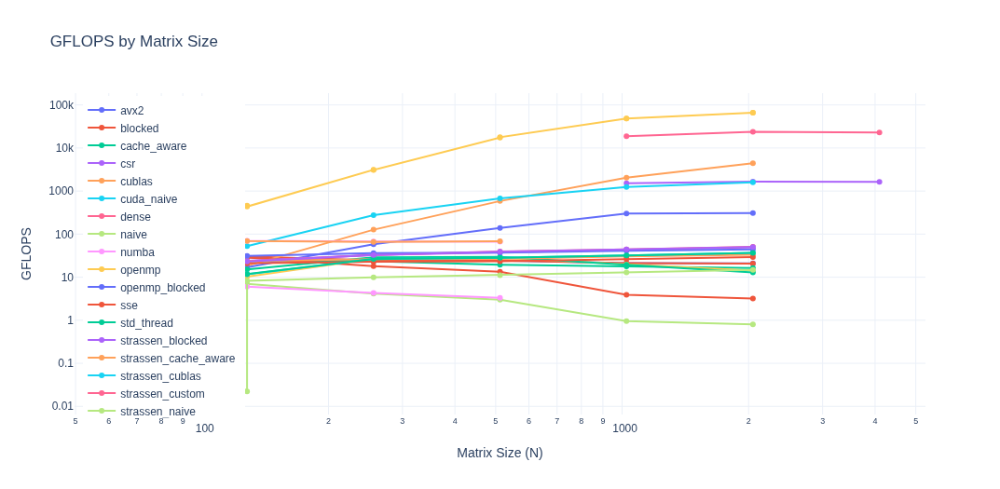
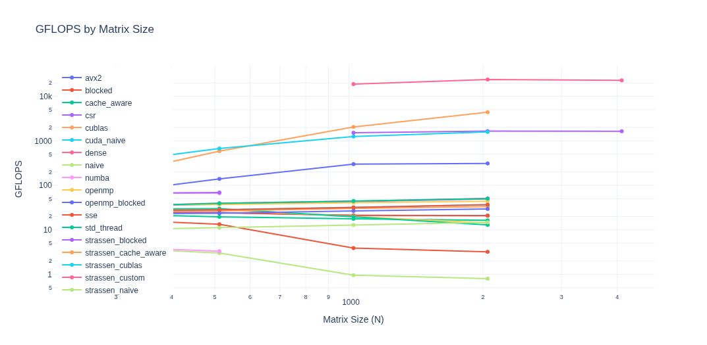
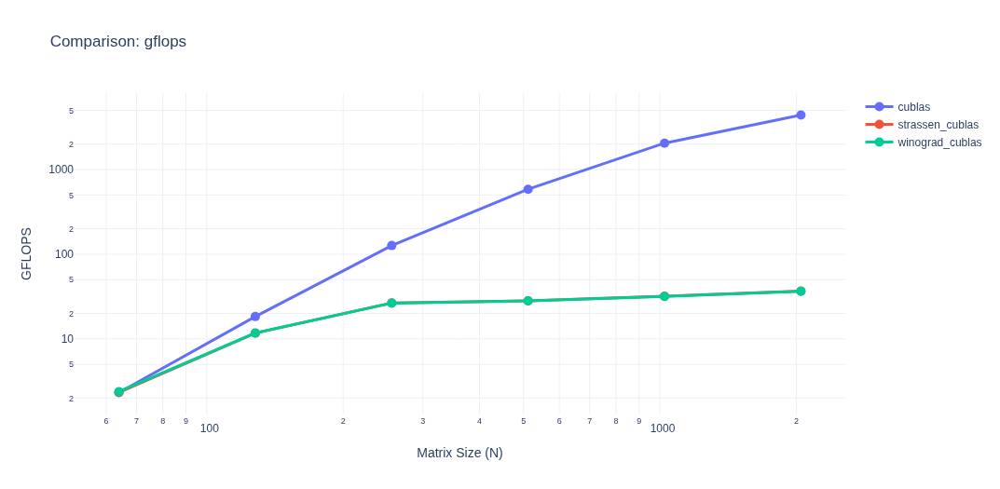
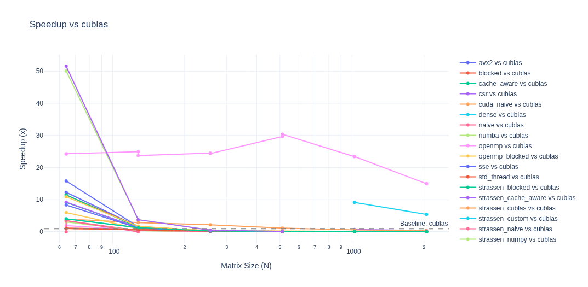
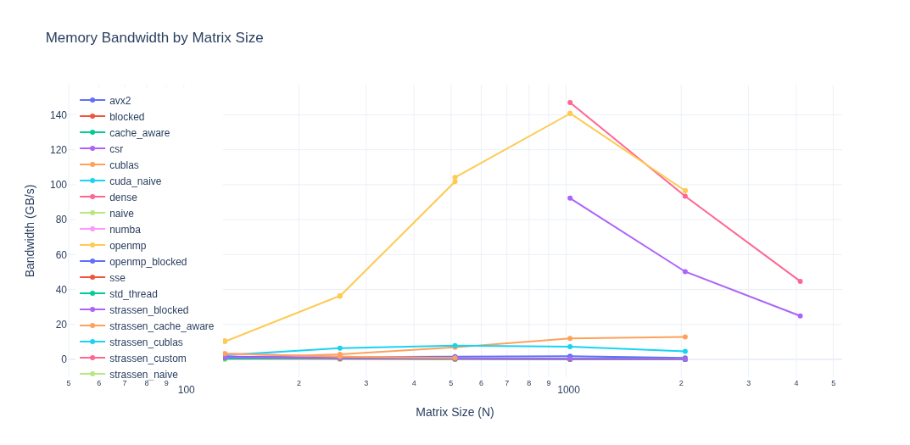
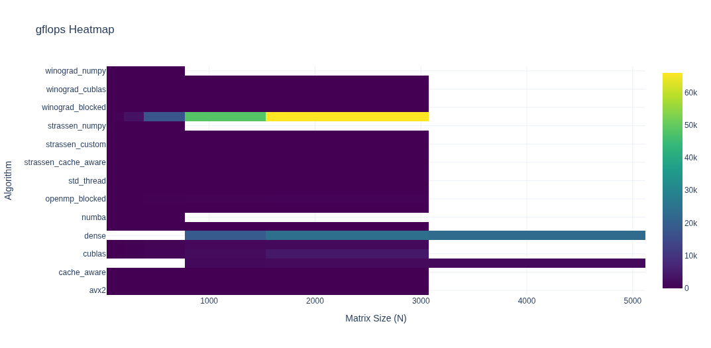

# x_gemms - GEMM Benchmarking Framework

A comprehensive benchmarking framework for General Matrix Multiplication (GEMM) operations across multiple hardware platforms, data types, and algorithmic implementations.

## Features

- **Multi-Platform**: CPU (Python, C++) and GPU (CUDA) implementations
- **Advanced Algorithms**: Strassen and Winograd-Strassen matrix multiplication
- **SIMD Optimizations**: SSE, AVX2, AVX512 vectorization
- **Parallel Computing**: OpenMP and std::thread parallelization
- **GPU Acceleration**: CUDA with cuBLAS and custom kernels
- **Tensor Core Support**: FP16/BF16 Tensor Core operations via PyTorch
- **Interactive Analysis**: Jupyter notebook with Plotly visualizations
- **Timestamped Results**: Track and compare benchmark runs over time

## Quick Start

```bash
# Install Python dependencies
pip install -r requirements.txt

# Build all (C++ and CUDA)
make

# Run benchmarks
python -m bench run --quick       # Sizes 64-1024
python -m bench run --medium      # Sizes up to 2048
python -m bench run --large       # Sizes up to 20000

# Run and save with timestamp
python -m bench run --medium --save
python -m bench run --medium --save --tag baseline

# Interactive analysis
python -m bench analyze                    # Launch Jupyter notebook
python -m bench analyze results/*.csv      # Analyze specific files
```

## CLI Usage

```bash
# Run benchmarks with different size presets
python -m bench run --quick       # Sizes 64, 128, 256, 512, 1024
python -m bench run --medium      # Sizes up to 2048
python -m bench run --large       # Sizes up to 20000

# Save results with timestamp
python -m bench run --quick --save
python -m bench run --medium --save --tag experiment1

# Control CPU threads
python -m bench run --quick --threads 4

# Force run all sizes (dangerous - may hang!)
python -m bench run --medium --force

# Skip specific modules
python -m bench run --quick --no-cpp
python -m bench run --quick --no-gpu
python -m bench run --quick --no-strassen
python -m bench run --quick --no-winograd
python -m bench run --quick --no-sparse

# Using Makefile
make test          # Build and run quick benchmarks
make test-medium   # Build and run medium benchmarks
make test-large    # Build and run large benchmarks
```

## Project Structure

```
x_gemms/
├── config.py              # Central configuration
├── requirements.txt       # Python dependencies
├── Makefile              # Top-level build
├── README.md             # This file
│
├── src/                  # Algorithm implementations
│   ├── python/           # Python implementations
│   │   ├── numpy.py     # NumPy baseline
│   │   ├── numba.py     # Numba JIT
│   │   ├── sparse.py    # Sparse matrix (CSR/COO)
│   │   ├── strassen.py  # Strassen algorithm
│   │   └── winograd.py  # Winograd-Strassen algorithm
│   ├── cpp/             # C++ CPU implementations
│   │   ├── main.cpp
│   │   ├── basic/       # naive, blocked, cache_aware
│   │   ├── simd/        # sse, avx2, avx512
│   │   ├── parallel/    # openmp, std_thread
│   │   └── strassen/    # Strassen/Winograd implementations
│   ├── cuda/            # CUDA GPU implementations
│   │   ├── main.cu
│   │   ├── basic/       # naive kernel
│   │   ├── cublas/      # cuBLAS reference
│   │   ├── cutlass/     # CUTLASS reference
│   │   ├── tensor_core.py
│   │   ├── strassen_cublas.cu
│   │   ├── strassen_custom.cu
│   │   ├── winograd_cublas.cu
│   │   └── winograd_custom.cu
│   └── dormant/         # Dormant implementations (TPU)
│
├── bench/                # Benchmarking utilities
│   ├── __main__.py      # CLI entry point
│   ├── runner.py        # Main benchmark orchestrator
│   ├── analyzer.py      # Interactive analysis with Plotly
│   ├── utils.py         # Matrix generation, timing helpers
│   ├── profiler.py      # GPU profiling (NSight)
│   ├── memory_tracker.py
│   └── notebooks/       # Jupyter notebooks
│       └── analyze.ipynb
│
├── tests/               # Test scripts
│   ├── test_all.py     # Main orchestrator
│   ├── test_basic.py   # C++ tests
│   ├── test_gpu.py     # GPU tests
│   └── test_tpu.py     # Tensor Core tests
│
├── paper_code/          # Research implementations (incomplete)
│   ├── abs_matmul.hpp
│   ├── abs_matmul_main.cpp
│   ├── MatMul_a_lil_faster.pdf
│   └── pebbling_game_faster_matmul.pdf
│
├── plots/               # Generated plots
│   └── *.png
│
└── results/             # Output directory
    ├── benchmark_*.csv  # Timestamped results
    └── benchmarks.csv   # Latest results
```

## Algorithm Implementations

| Category | Algorithm | Platform | Complexity |
|----------|-----------|----------|------------|
| **Naive** | Triple-loop | CPU/GPU | O(n³) |
| **Blocked** | Cache-blocked | CPU/GPU | O(n³) |
| **Cache-Aware** | Optimized blocking | CPU | O(n³) |
| **SIMD** | SSE (128-bit) | CPU | O(n³) |
| **SIMD** | AVX2 (256-bit) | CPU | O(n³) |
| **SIMD** | AVX512 (512-bit) | CPU | O(n³) |
| **Parallel** | OpenMP | CPU | O(n³) |
| **Parallel** | OpenMP Blocked | CPU | O(n³) |
| **Parallel** | std::thread | CPU | O(n³) |
| **Strassen** | Naive recursive | CPU (Python) | O(n²·⁸⁰⁷) |
| **Strassen** | Blocked | CPU/GPU | O(n²·⁸⁰⁷) |
| **Strassen** | Cache-aware | CPU | O(n²·⁸⁰⁷) |
| **Winograd** | Blocked | CPU/GPU | O(n²·⁸⁰⁷) |
| **Winograd** | Cache-aware | CPU | O(n²·⁸⁰⁷) |
| **Library** | cuBLAS | GPU | Optimized |
| **Library** | CUTLASS | GPU | Optimized |
| **Tensor Core** | FP16/BF16 | GPU | Hardware |

## Strassen & Winograd Algorithms

### Overview

**Strassen's Algorithm** (1969) reduces matrix multiplication from 8 to 7 multiplications for 2×2 blocks, achieving O(n²·⁸⁰⁷) instead of O(n³).

**Winograd-Strassen** uses the same 7 multiplications but only 15 additions instead of Strassen's 18, providing a minor performance improvement.

### Implementation Details

| Implementation | Memory Management | Notes |
|---------------|-------------------|-------|
| Python Naive | Per-recursion allocation | Slow, for correctness |
| Python NumPy | Vectorized operations | Fast baseline |
| C++ Naive | Per-recursion allocation | Reference implementation |
| C++ Blocked | Blocked recursive | Better cache usage |
| C++ Cache-Aware | Memory pool | Reuses memory across recursion |
| CUDA cuBLAS | cuBLAS for base case | Hybrid approach |
| CUDA Custom | Custom kernels | Lower overhead for small sizes |

### Configuration

The crossover threshold (when Strassen switches to naive/blocked) is configurable in `config.py`:

```python
STRASSEN_CROSSOVER_THRESHOLD = 64  # Default
```

### Key Observations

1. **Crossover Point**: Strassen becomes beneficial at larger matrix sizes (typically N > 64-128)
2. **Memory Trade-off**: Strassen requires ~30% more memory due to temporary matrices
3. **GPU Performance**: Custom CUDA kernels can outperform cuBLAS at small sizes due to lower kernel launch overhead

## Benchmark Naming Convention

Results use the format: `(Device)-(Algorithm)-(Library)-(Language)`

| Tag | Description |
|-----|-------------|
| `CPU-Naive-Cpp` | C++ triple-loop naive |
| `CPU-Naive-NumPy-Python` | NumPy @ operator |
| `CPU-Naive-Numba-Python` | Numba JIT |
| `CPU-SIMD-SSE-Cpp` | C++ SSE 128-bit |
| `CPU-SIMD-AVX2-Cpp` | C++ AVX2 256-bit |
| `CPU-SIMD-AVX512-Cpp` | C++ AVX512 512-bit |
| `CPU-Blocked-Cpp` | C++ cache-blocked |
| `CPU-Strassen-Naive-Python` | Python Strassen naive |
| `CPU-Strassen-NumPy-Python` | Python Strassen with NumPy |
| `CPU-Strassen-Blocked-Cpp` | C++ Strassen blocked |
| `CPU-Strassen-CacheAware-Cpp` | C++ Strassen cache-aware |
| `CPU-StrassenWinograd-NumPy-Python` | Python Winograd |
| `CPU-StrassenWinograd-Blocked-Cpp` | C++ Winograd blocked |
| `CPU-Parallel-OpenMP-Cpp` | OpenMP parallel (naive) |
| `CPU-Parallel-OpenMP-Cpp-Blocked` | OpenMP parallel (blocked) |
| `CPU-Parallel-StdThread-Cpp` | std::thread parallel |
| `GPU-CUDA-Cpp` | CUDA naive kernel |
| `GPU-CUDA-cuBLAS-Cpp` | cuBLAS |
| `GPU-Strassen-cuBLAS-Cpp` | Strassen with cuBLAS base |
| `GPU-Strassen-CUDA-Cpp` | Strassen with custom kernels |
| `GPU-StrassenWinograd-cuBLAS-Cpp` | Winograd with cuBLAS |
| `GPU-TensorCore-PyTorch-fp16-Python` | Tensor Core fp16 |
| `GPU-TensorCore-PyTorch-bf16-Python` | Tensor Core bf16 |
| `CPU-Sparse-SciPy-Python` | SciPy sparse CSR |
| `GPU-Sparse-PyTorch-Python` | PyTorch sparse |

## Size Limits

| Category | Sizes | Single-thread | Parallel/GPU |
|----------|-------|---------------|--------------|
| Quick | 64, 128, 256, 512, 1024 | ✓ | ✓ |
| Medium | 64-2048 | ✓ | ✓ |
| Large | up to 20000 | ✗ (skipped) | ✓ up to 8192 |

Use `--force` flag to override size limits (dangerous - may hang!).

## Result Analysis

### Timestamped Results

Results are saved with timestamps when using `--save`:

```
results/
├── benchmark_2026-04-06_14-30-00.csv      # --save only
├── benchmark_2026-04-06_14-35-00_baseline.csv  # --save --tag baseline
└── benchmarks.csv                          # Legacy (no --save)
```

### CSV Format

```csv
# x_gemms benchmark results
# timestamp: 2026-04-06T14:30:00
# hostname: workstation
# cuda: 13.1
# gpu: NVIDIA RTX 5070
module,algorithm,size,dtype,time_ms,gflops,bandwidth_gbs,sparsity
python,strassen_numpy,64,fp32,0.004,118.86,11.14,
```

### Interactive Analysis

```python
from bench.analyzer import BenchmarkAnalyzer

# Load results
analyzer = BenchmarkAnalyzer.from_latest()
# Or: analyzer = BenchmarkAnalyzer.from_multiple(["results/benchmark_*.csv"])

# Get insights
analyzer.get_summary()
analyzer.get_best_performers()
analyzer.get_speedup(baseline='cublas')

# Plot with Plotly
fig = analyzer.plot_gflops()
fig.show()

# Filter and export
filtered = analyzer.filter(sizes=(256, 4096), dtypes=['fp32'])
filtered.export_filtered_csv('subset.csv')

# Timing comparison
fig = analyzer.plot_timing_comparison()
fig.show()
```

## Example Results

### GFLOPS by Matrix Size



### GFLOPS Comparison (Filtered)



### Algorithm Comparison



### Speedup Analysis



### Memory Bandwidth



### Performance Heatmap



## Performance Investigations

### 1. C++ OpenMP Performance Anomaly

Plain OpenMP (`openmp` algorithm) is **slower** than single-threaded SIMD implementations:

| Algorithm | N=1024 GFLOPS |
|-----------|---------------|
| avx2 | 21.2 |
| openmp | 13.2 |
| **openmp_blocked** | **155.5** |

**Why?** Plain OpenMP on naive algorithm suffers from cache thrashing and false sharing. The blocked version achieves ~10x speedup.

### 2. Sparse Matrix GPU Performance

At 90% sparsity, GPU sparse CSR is **~12x slower** than dense:

| Format | N=1024 GFLOPS |
|--------|---------------|
| dense (GPU) | 18,742 |
| csr (GPU) | 1,524 |

PyTorch sparse tensor operations have significant overhead for this sparsity level.

### 3. Numba Performance Degradation

Numba JIT shows degradation with larger sizes:

| N | Numba GFLOPS |
|---|--------------|
| 64 | 7.5 |
| 512 | 3.3 |
| 1024 | 1.0 |

Single-threaded naive algorithm doesn't scale; blocked implementation needed.

### 4. C++ vs GPU Crossover Point

| N | C++ (openmp_blocked) | GPU | Tensor Core |
|---|---------------------|-----|-------------|
| 64 | 16.2 GFLOPS | 9.1 GFLOPS | 55.8 GFLOPS |
| 512 | 143.2 GFLOPS | 615.5 GFLOPS | 16,818 GFLOPS |
| 1024 | 155.5 GFLOPS | 2,000 GFLOPS | 47,500 GFLOPS |

GPU is faster even at small sizes; Tensor Core dominates.

### 5. Thread Scaling

OpenMP blocked scales non-linearly:

| Threads | N=1024 GFLOPS |
|---------|---------------|
| 1 | ~25 |
| 4 | ~80 |
| 8 | ~155 |

## Hardware Configuration

| Component | Specification |
|-----------|---------------|
| **CPU** | Intel Core Ultra 7 265K |
| **GPU** | NVIDIA RTX 5070 (Blackwell, sm_120) |
| **GPU Memory** | 12 GB GDDR7 |
| **System RAM** | 64 GB DDR5 |
| **CUDA Version** | 13.1 |

## TODO / Future Work

### Code Quality
- [ ] Update C++ code to use smart pointers instead of raw malloc/free
- [ ] Test Thrust library for CUDA implementations
- [ ] Add comprehensive error handling for CUDA allocations
- [ ] Add numerical accuracy benchmarks for Strassen/Winograd

### Algorithms
- [ ] Analyze papers in `paper_code/` and properly implement Alternative Basis Strassen
- [ ] Optimize CUDA Strassen/Winograd with shared memory tiling
- [ ] Add fused kernel implementations for Strassen
- [ ] Implement adaptive crossover thresholds

### Features
- [ ] Memory tracking integration
- [ ] Cache analysis with NSight Compute
- [ ] Tensor Core INT8 benchmarks
- [ ] Multi-GPU support

### Research
- [ ] Determine Strassen crossover point for each platform
- [ ] Compare Strassen vs Winograd performance trade-offs
- [ ] Study memory bandwidth bottlenecks
- [ ] Profile OpenMP with `perf` or `OMP_PROFILER`

### paper_code/ Directory

Contains incomplete implementation of Alternative Basis Strassen algorithm:

- `abs_matmul.hpp` / `abs_matmul_main.cpp` - Prototype implementation
- `MatMul_a_lil_faster.pdf` - Research paper
- `pebbling_game_faster_matmul.pdf` - Research paper

See `paper_code/` for source code and PDFs.

## Optimization Notes

### Single Matrix Generation (v2.0+)

Matrices are generated **once for the maximum size** and subsets are used for smaller sizes. This reduces initialization time (~6x for medium tests).

```cpp
// Find max size from the sizes list
size_t max_size = sizes[0];
for (size_t s : sizes) if (s > max_size) max_size = s;

// Generate once for max size
float *A = malloc(max_size * max_size * sizeof(float));
initialize_matrix(A, max_size);

// For each size, algorithms only access A[0:N][0:N]
for (size_t N : sizes) {
    benchmark_algorithm(A, B, C, N);
}
```

### Parallel Initialization

Matrix initialization uses OpenMP parallel for:

```cpp
void initialize_matrix(T* A, size_t N) {
    #pragma omp parallel for
    for (size_t i = 0; i < N * N; ++i) {
        A[i] = static_cast<T>(rand() % 100) / 10.0f;
    }
}
```

### Memory Pool for Strassen/Winograd

Cache-aware implementations use a pre-allocated memory pool to avoid repeated allocation during recursion:

```cpp
template <typename T>
class StrassenMemoryPool {
    T* pool;
    size_t offset;
public:
    T* allocate(size_t count);
    size_t get_offset() const;
    void set_offset(size_t offset);  // For recursion rollback
};
```

## References

1. Strassen, V. (1969). "Gaussian elimination is not optimal"
2. Winograd, S. (1971). "On multiplication of 2×2 matrices"
3. Schwartz, O. & Vaknin, S. "Pebbling Game and Faster Matrix Multiplication" (see `paper_code/`)

---

*Last Updated: April 2026*
